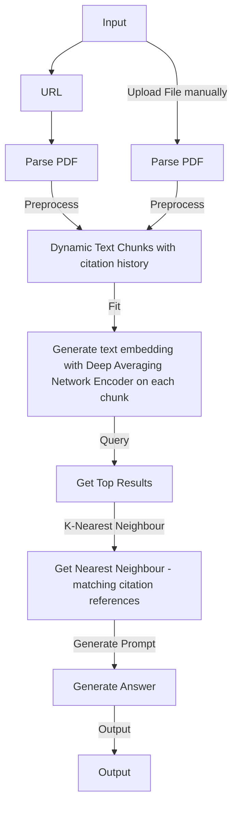

# 背景

可能是最近才开始关注Github上关于LLM和AIGC的更新，用日新月异来形容毫不过分。每天的Github trending都在变，而且绝大部分都是关于AI，非相关内容已经排不上trending了。

2016年AlphaGo出来下棋的时候，还没有体会到AI能够发展成为今天的样子，因为把棋下好这件事和日常生活提效，或者是人工智能取代人工这个构想之间的逻辑关系过于大，不光大头兵们，大佬们肯定也没想到，不然他们早就入局了，不至于OpenAI都做出来了才都纷纷带着自己的家底入场。

对于一个从事编程行业的人来说，哪些应该是我的关注点呢？

# Breakdown

首先，大模型大概率没法做。这个事情没有多少资本都没有入场券那种，不过我倒是很好奇，如果在现在的模型基础上做fine-tune，怎么做呢？不能有一个想法就去训练，成本太高了，肯定需要有一些快速试错和迭代的方法。这里我不太了解，后续关注一下准备再写一篇笔记。

其次，基于大模型能做什么？现在的垂直市场是绝对的蓝海，因为没有一个非常Dominant的公司在垂直领域做到了一个足够爆款的App，就算做出来了，这个门槛也比较低，举个最简单的例子，MidJourney现在多少人在用？Bing现在都集成了Dall-E了，每个人都能上去画图，谁还会用收费的MidJourney吗？我觉得时间长了肯定没人用了，除非能在速度和质量或者易用性上产生明显的差异。当然目前来看，Bing这里暂时还不太行。

那么关于垂类应用，最有前景的是什么？我大胆预测一下是数据预处理 + ChatGPT。为什么是数据预处理，因为OpenAI给了一个Token Limit，就是一次发送给OpenAI的字符数量是有限的，并且是收费的，发过去的内容越多，分析的成本就越高，比如大数据分析，文章摘要等。因此这里肯定是可以有护城河的东西，因为这里有了现实的限制，就连OpenAI自己也没办法发送无限多的Token给自己的大模型。这里很多技巧就可以用上了，展示三个应用，都是最近Github上非常火的开源项目。

- [vault-ai](https://github.com/pashpashpash/vault-ai)： 通过上传自己的文档，建立自己的私人知识库。
- [pdfGPT](https://github.com/bhaskatripathi/pdfGPT)：上传PDF，然后可以对PDF进行提问。
- ChatGPT code interpreter插件：上传csv文件，告诉ChatGPT你想生成的结果，某种结论或者图片都可以，然后生成Python Code并运行，返回给用户处理的结果。（直接拿到Python Code自己运行也是可以的，参考这篇文章：[WeChat Article](https://mp.weixin.qq.com/s/4jNYSW-AVKcpXuhRlUAu1w)

前两个的思路都是非常接近的，把输入的文档处理成embedding，然后把问题也encode成embedding，把问题的embedding和所有输入的embedding的进行相关性查找，找到最相关的前n个文本块，和问题一起封装成一个prompt发送给ChatGPT，从而能够回答你的问题。

PDFGPT的Flowchart

最后一个是数据分析相关的，海量数据自然也是不能直接喂给ChatGPT的，因此OpenAI的思路就是读取一部分上传文件，csv读头部前几行即可，就能知道文件和什么相关，并且还有部分样例数据，随后根据用户的指令生成一些Python代码，执行代码并且把分析好的结果返回给用户。多了一些自动化，确实方便很多，这个能做比较小型的数据分析，大型的肯定无法通过上传文件做到。

我们可以看到，这两者的预处理都是有损的，并不是和大模型直接交互的。既然是有损的，那么谁的损失更少，谁的结果更精准，让用户花费时间更少，同时自己的成本更低，谁就更有机会胜出。并且大模型不好实时更新，recommender总可以吧，这都是多么成熟的领域了，集成个语言大模型到自己的工作流里面也不会有多困难。但本身这里还有个tradeoff，能给大模型更多的信息总是更好的，这也导致了这些方法都是Token hungry的。对于数据分析来说，生成的Python更准确，prompt的字数越少，越能胜出。

最后，知道这些了能做什么吗？我个人认为还是从实际需求入手，从自己的工作流入手，做一个特别垂直的事情。没有乔老爷那么敏锐的用户洞察力，自己工作流里遇到的问题，就是大家会遇到的问题。多了的地方只能通过聊天获取，但sizing有多大，这个就无法判断了。

# Conclusion

来自Bing的总结：

The text is about the recent developments in AI, especially large language models (LLM) and AI-generated content (AIGC). The author discusses the challenges and opportunities for programmers in this field. The author suggests that data preprocessing and chat-based applications are the most promising areas for innovation. The author also gives some examples of popular open-source projects that use LLM and AIGC, such as vault-ai, pdfGPT, and ChatGPT code interpreter. The author argues that both tools have some tradeoffs in terms of preprocessing, accuracy, cost and prompt length. The author suggests that the best way to use these tools is to find a specific and vertical problem from one’s own workflow.

> 这篇文章主要介绍了AI领域的最新进展，特别是大型语言模型(LLM)和AI生成内容(AIGC)。作者分析了这个领域中程序员面临的挑战和机遇。作者认为数据预处理和聊天式应用是最有创新潜力的领域。作者还举了一些使用LLM和AIGC的热门开源项目的例子，比如vaut-ai,pdfGPT,和ChatGPT code interpreter。作者指出这两种工具在预处理、准确性、成本和提示长度方面都有一些权衡。作者建议使用这些工具的最佳方法是找到一个自己工作流中的具体而垂直的问题。

